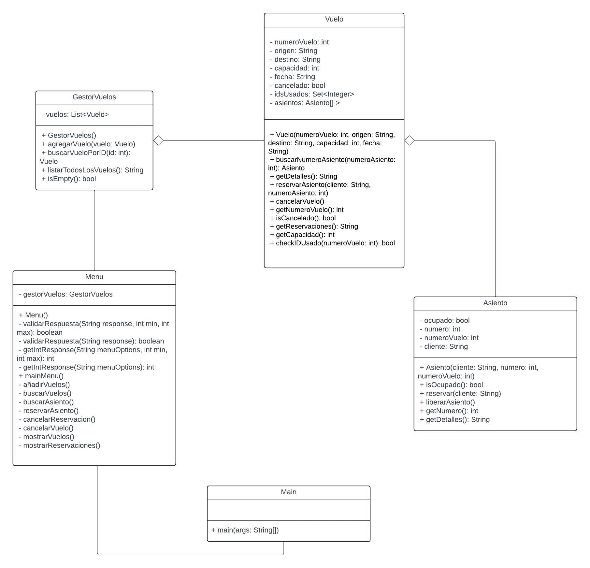

# Sistema de Reservación de Vuelos

## Descripción

Este proyecto consiste en desarrollar un sistema de reservación de vuelos utilizando la clase `JOptionPane` de la librería SWING de Java para la interfaz. El proyecto es parte del curso "Introducción a la Programación" en la Ingeniería en Sistemas de Computación.

## Miembros del Grupo 1

- **CHAVES BRENES SANTIAGO**
- **CHAVES BRENES JUAN ANTONIO**
- **GARRO ROLDÁN JAFETH ARTURO**
- **MORA PORRAS GRISEL CAROLINA**

## Estructura del Proyecto

### Diagrama de Clase



### Clase `Asiento`

La clase `Asiento` representa un asiento en un vuelo. Contiene los detalles del pasajero, número de asiento y número de vuelo.

```java
public class Asiento {
    private String pasajero;
    private final int numeroAsiento;
    private final int numeroVuelo;

    // Constructor
    public Asiento(String pasajero, int numeroAsiento, int numeroVuelo) {
        this.pasajero = pasajero;
        this.numeroAsiento = numeroAsiento;
        this.numeroVuelo = numeroVuelo;
    }

    // Métodos
    public void reservarAsiento(String pasajero) throws Exception { /* ... */ }
    public String getDetalles() { /* ... */ }
    public void liberarAsiento() throws Exception { /* ... */ }
    public boolean isDisponible() { /* ... */ }

    // Getters
    public String getPasajero() { return pasajero; }
    public int getNumeroAsiento() { return numeroAsiento; }
    public int getNumeroVuelo() { return numeroVuelo; }
}
```

### Clase `Vuelo`

La clase `Vuelo` representa un vuelo y contiene detalles como número de vuelo, origen, destino, capacidad, fecha, estado de cancelación y asientos.

```java
public class Vuelo {
    private final int numeroVuelo;
    private final String origen;
    private final String destino;
    private final int capacidad;
    private final String fecha;
    private boolean cancelado;
    private static final Set<Integer> idsUsados = new HashSet<>();
    private final Asiento[] asientos;

    // Constructor
    public Vuelo(int numeroVuelo, String origen, String destino, int capacidad, String fecha) throws Exception { /* ... */ }

    // Métodos
    public Asiento buscarNumeroAsiento(int numeroAsiento) throws NoSuchElementException { /* ... */ }
    public String getDetalles() { /* ... */ }
    public String getReservaciones() { /* ... */ }
    public String getNumeroAsientosDisponibles() { /* ... */ }
    public boolean isLleno() { /* ... */ }

    // Getters
    public int getNumeroVuelo() { return numeroVuelo; }
    public String getDestino() { return destino; }
    public String getOrigen() { return origen; }
    public int getCapacidad() { return capacidad; }
    public String getFecha() { return fecha; }
    public boolean isCancelado() { return cancelado; }
    public void cancelarVuelo() { this.cancelado = true; }
    public Asiento[] getAsientos() { return asientos; }

    // Verificar ID
    static boolean checkIDUsado(int id) { return idsUsados.contains(id); }
}
```

### Clase `GestorVuelos`

La clase `GestorVuelos` administra una lista de vuelos y proporciona métodos para añadir, buscar y listar vuelos.

```java
public class GestorVuelos {
    private final ArrayList<Vuelo> listaDeVuelos;

    // Constructor
    public GestorVuelos() { this.listaDeVuelos = new ArrayList<>(); }

    // Métodos
    public void addVuelo(Vuelo vuelo) { this.listaDeVuelos.add(vuelo); }
    public ArrayList<Vuelo> getVuelos() { return this.listaDeVuelos; }
    public String listarTodosLosVuelos() { /* ... */ }
    public Vuelo buscarVueloPorID(int numeroVuelo) throws NoSuchElementException { /* ... */ }
    public boolean isEmpty() { return listaDeVuelos.isEmpty(); }
}
```

### Clase `Menu`

La clase `Menu` proporciona la interfaz gráfica para interactuar con el sistema de reservación de vuelos utilizando `JOptionPane`.

```java
public class Menu {
    private final GestorVuelos gestorVuelos;

    // Constructor
    public Menu() { gestorVuelos = new GestorVuelos(); }

    // Métodos de validación y entrada de datos
    private boolean validarRespuesta(String response, int min, int max) { /* ... */ }
    private boolean validarRespuesta(String response) { /* ... */ }
    private int getIntResponse(String menuOptions, int min, int max) { /* ... */ }
    private int getIntResponse(String menuOptions) { /* ... */ }

    // Menú principal
    public void mainMenu() { /* ... */ }

    // Métodos para manejar opciones del menú
    private void agregarVuelo() { /* ... */ }
    private void buscarVuelo() { /* ... */ }
    private void buscarAsiento() { /* ... */ }
    private void reservarAsiento() { /* ... */ }
    private void cancelarReservacion() { /* ... */ }
    private void cancelarVuelo() { /* ... */ }
    private void mostrarVuelos() { /* ... */ }
    private void mostrarReservaciones() { /* ... */ }
}
```

## Especificación del Proyecto

El proyecto consiste en implementar un sistema de reservación de vuelos con las siguientes funcionalidades:

- [X] **Añadir vuelos**
- [X] **Buscar vuelos**
- [X] **Buscar asiento**
- [X] **Reservar un asiento**
- [X] **Cancelar una reservación**
- [X] **Cancelar un vuelo**
- [X] **Mostrar el estado actual de todos los vuelos y reservaciones realizadas**
- [ ] **Persistencia de datos**

## Requisitos

- [x] El número de vuelo debe ser único.
- [X] Verificar la capacidad del vuelo antes de realizar una reservación.
- [x] Mostrar mensajes de éxito o error al usuario.
- [X] Utilizar `JOptionPane` para la interfaz gráfica.
- [ ] Persistencia de datos para mantener la información después de cerrar la aplicación.

## Instrucciones de Ejecución

1. Clonar el repositorio:
   ```bash
   git clone https://github.com/IAmJafeth/Proyecto-SC-202.git
   ```
2. Importar el proyecto en su IDE preferido (NetBeans, IntelliJ IDEA, etc.).
3. Compilar y ejecutar el proyecto.

## Presentación y Demostración

- **Introducción**:

    - Presentar a todos los integrantes del grupo.
    - Presentar la temática del proyecto.

- **La Solución**:

    - Presentar el proyecto, implementación de algoritmos y cómo se cumplen las condiciones de cada módulo.
    - Mostrar ejemplos específicos de código.
    - Ejecutar y demostrar que el proyecto funciona correctamente.

- **Retos y Lecciones**:
    - Compartir los retos y lecciones aprendidas durante la implementación del proyecto.

## Contribuciones

Las contribuciones a este proyecto son realizadas por los miembros del Grupo 1.

## Licencia

Este proyecto no cuenta con una licencia específica. Consulte con los autores para más detalles.
